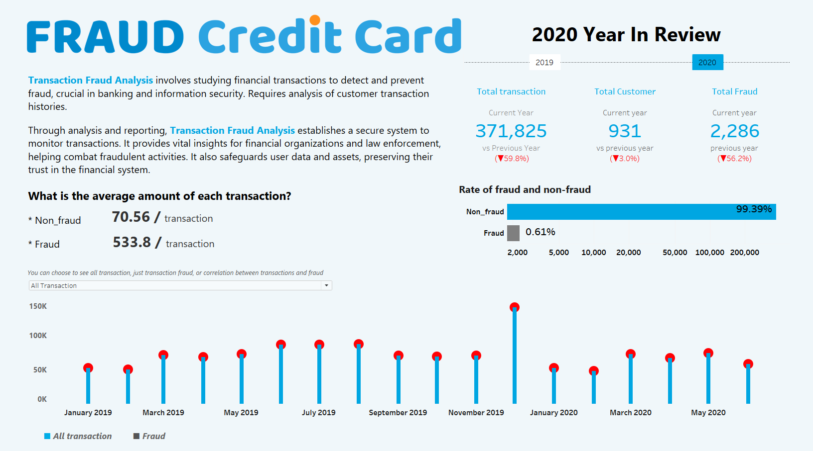
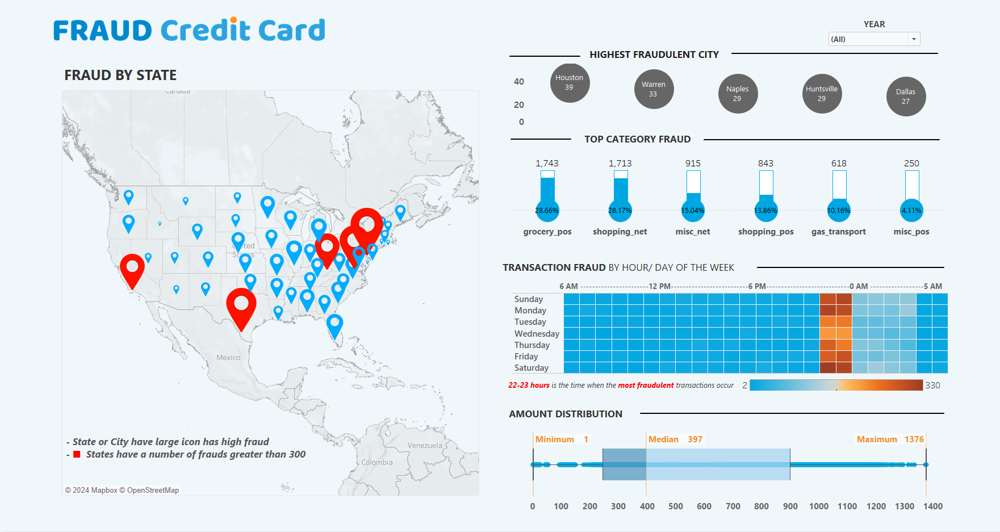
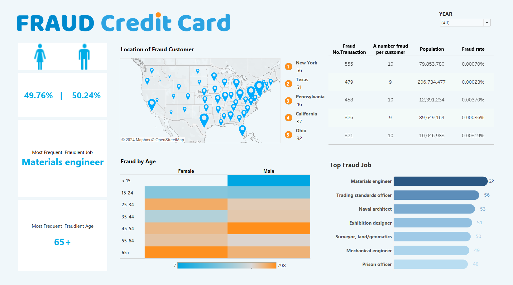
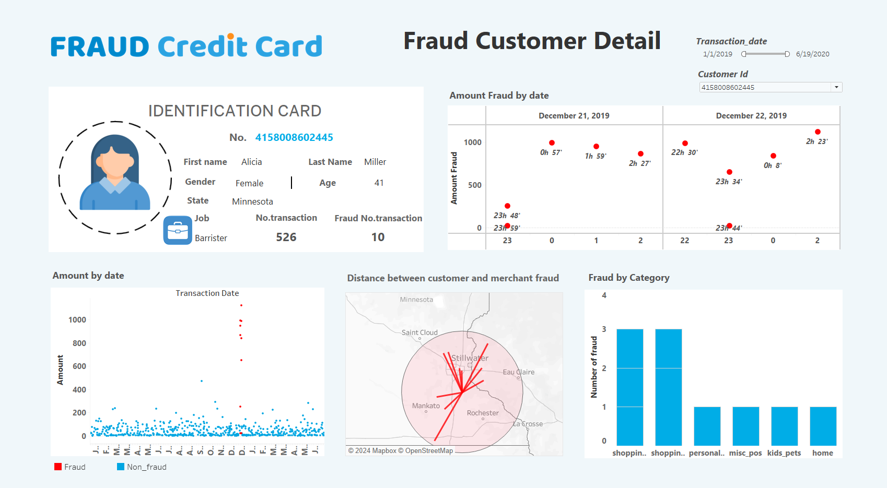
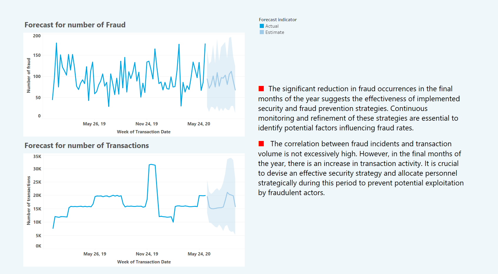

# Credit Card Fraud

 **Author**: Dang Yen Linh

**Email**: dangyenlinhh@gmail.com

**Linkedln**: https://www.linkedin.com/in/dangyenlinhh/

*Explore the full interactive experience and uncover hidden insights in my dashboards by visiting **My tableau Public link** https://tabsoft.co/49iWhF1k. Thank you!*

To enable businesses to grasp the behaviors and trends of potential fraudsters, I've meticulously constructed a comprehensive dashboard system, featuring:

1. **Yearly Overview**: Dashboard offering a concise yearly snapshot of transaction trends.

2. **Fraud Characteristics**: Dashboard delving into key traits defining fraudulent activities.

3. **Fraudster Profiles**: Dashboard spotlighting distinctive profiles and attributes of fraudsters.

4. **Fraud Profiles**: Dashboard providing detailed insights into identified fraud cases.

5. **Fraud Trends Prediction**: Dashboard leveraging predictive analytics to anticipate future fraud trends.
   

    

The data set includes transactions from January 2019 to the end of December 2020. In order to provide an overview of the business's fraud situation during the year, the above dashboard was built to provide some information :

• Variation of total transactions, total customers and total fraud by year.

• Ratio between fraudulent and non-fraudulent transactions in 2020.

• Detailed information about the average transaction amount for each type, allowing comparisons between legitimate and fraudulent transactions.

• Trend overview of all transactions, only fraudulent transactions, as well as the correlation between fraudulent transactions and all transactions from the beginning of 2019 to the end of 2020.

    

Besides the overview described in the previous dashboard, the above dashboard will provide another perspective, helping to analyze fraud characteristics in more detail. Specifically, the dashboard above provides detailed information about:

• The states/cities where the highest number of fraudulent transactions are recorded, as well as corresponding to those cities, which merchants suffer the most fraud.

• Categories account for the majority of fraudulent transactions.

• Times of day when fraudulent transactions often occur.

• Distribute the amount of fraudulent transactions.

    

In addition to understanding general information about fraudulent transactions, as well as the history of when and where they occurred, we also need to understand what characteristics fraudsters often have. Dashboard above is built to provide information:

• Proportion of men and women among fraudulent customers.

• Identify the area with the highest number of cheaters, and estimate the average number of cheaters for each cheater (total cheater/number of cheaters), average cheating rate troops per capita (total fraud/population).

• The distribution of cheating by age and gender.

• Occupation of the subjects who cheat most often.

    

Furthermore, I also built a dashboard to learn details about each fraudulent customer's profile. Specifically for each fraudulent customer profile to review, this dashboard provides some personal information such as name, age, hometown, occupation, gender, as well as the total number of fraudulent transactions they have made perform.

Beside that, businesses can also track the trend of that customer's transactions over time, as well as details about time, location, along with the distribution of categories of fraudulent transactions that customers make that item has been made.

    

In addition to statistics and analysis of customers' fraud history, I also make predictions about the number of fraud cases as well as the total number of transactions in the near future. Through these predictions, businesses can plan strategies to allocate the number of employees, as well as strengthen security systems and prevent fraud in the most effective way.

## Insights 
Through the dashboards built above, we can see some characteristics of fraudulent transactions, as well as fraud subjects as follows:

1. **Transaction Time**: There is a concentration in certain time frames (22-3 o'clock) in the evening to early morning, reflecting fraudulent activities during times when there is little supervision. In addition, the number of frauds on weekends is also higher than on weekdays.
   
2. **Location and Time**: Fraud often occurs in cities with high population density. Specifically, fraud is often concentrated mainly in states such as New York, Texas, and Pennsylvania.
 
3. **Transaction Value**: The average transaction amount of fraudulent transactions is much higher than that of legitimate transactions. Specifically in 2020, the average amount of legal transactions was 70.56/transaction and fraudulent transactions was 533.8/transaction. The amount of fraud ranges from ($1,1376$) with a median of $397.
 
4. **Age Range**: Various ages of cheaters from middle-aged to elderly (20 - 70 years old). Most concentrated are men (45-54 years old) and women (over 65 years old).
   
5. **Transaction Type**: The most commonly fraudulent categories are grocery_pos, shopping_net. In particular, grocery_pos's average fraud amount is only about $312.0/transaction, much lower than shopping_net's average fraud amount of about $999.3/transaction.
   
6. **Occupation**: People who commit fraud are often highly knowledgeable people. The professions with the most fraud are Materials engineer, Trading standards officer, Naval architect. They are very smart, often starting with small amounts of fraud, then moving on to larger transactions. In addition, they also avoid fraud at the same location, most fraudulent transactions take place at different merchants.
   
7. **Prediction**: the number of frauds in the coming period, the significant reduction in the number of fraud occurrences in the last months of the year is a positive sign showing the effectiveness of security system building strategies. security, fraud prevention and confidentiality are implemented. In addition, in the last months of the year, the number of transactions also increased slightly, so businesses also need to allocate personnel strategically during this period to prevent fraudulent acts.

