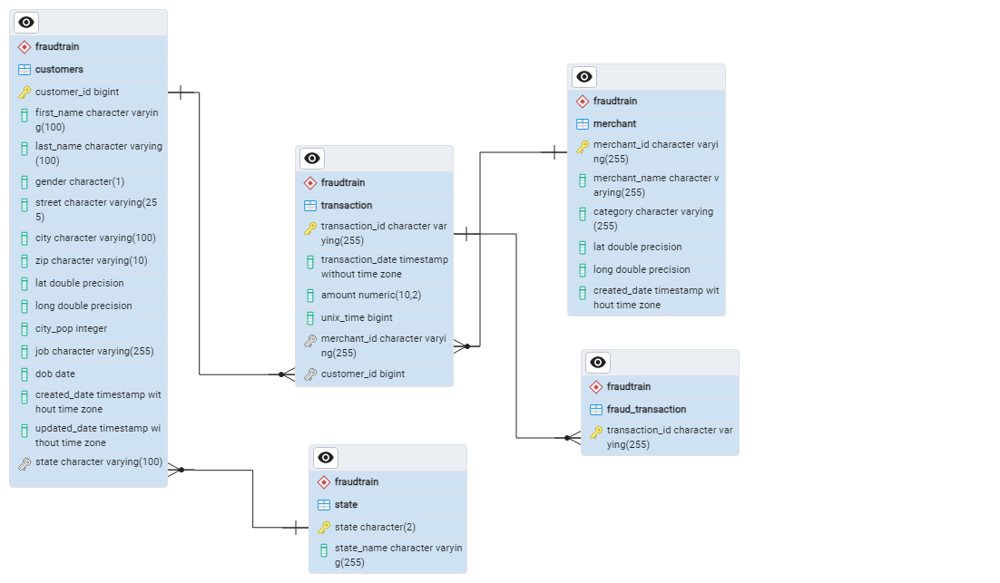

#  Credit Card Fraud

**Author**: Dang Yen Linh

**Email**: dangyenlinhh@gmail.com

**Linkedln**: https://www.linkedin.com/in/dangyenlinhh/

## Entity Relationship Diagram

## A. Create Table

```` SQL
CREATE SCHEMA fraudTrain;

-- Create five tables we are going to import of csv data into.

-- Merchant table
DROP TABLE IF EXISTS fraudTrain.merchant;

CREATE TABLE fraudTrain.merchant(
	merchant_id VARCHAR(255) PRIMARY KEY,
	merchant_name VARCHAR(255),
	catergory VARCHAR(255),
	lat DOUBLE PRECISION,
	long DOUBLE PRECISION,
	created_date TIMESTAMP DEFAULT CURRENT_TIMESTAMP
);

-- Customer table 
DROP TABLE IF EXISTS fraudTrain.customers(
	customer_id BIGINT PRIMARY KEY,
	first_name VARCHAR(100),
	last_name VARCHAR(100),
	gender CHAR(1),
	street VARCHAR(255),
	city VARCHAR(100),
	state VARCHAR(100),
	zip VARCHAR(10),
	lat DOUBLE PRECISION,
	long DOUBLE PRECISION,
	city_pop INT,
	job VARCHAR(255),
	dob DATE,
	created_date TIMESTAMP DEFAULT CRRENT_TIMESTAMP,
	updated_date TIMESTAMP
);

-- Transaction table
DROP TABLE IF EXISTS frauTrain.transaction

CREATE TABLE fraudTrain.transaction(
	transaction_id VARCHAR(255) PRIMARY KEY,
	transaction_date TIMESTAMP,
	amount DECIMAL(10,2),
	unix_time BIGINT,
	merchant_id VARCHAR(255) REFERENCES fraudTrain.merchant(merchant_id)
	customer_id BIGINT REFERENCES fraudTrain.customers(customer_id)
);

-- fraud_transaction table
DROP TABLE IF EXISTS fraudTrain.fraud_transaction
CREATE TABLE fraudTrain.fraud_transaction(
	transaction_id VARCHAR(255) PRIMARY KEY REFERENCES fraudTrain.transaction(transaction_id)
);

-- Country name table
DROP TABLE IF EXISTS fraudTrain.country
	
CREATE TABLE fraudTrain.country(
	countryname VARCHAR(255),
	state CHAR(2)
);

````
### Create Temp Table

````sql
-- NON FRAUD
CREATE TEMPORARY TABLE nonFraud AS (
	SELECT T.transaction_id,transaction_date, merchant_id,customer_id,amount,unix_time
	FROM fraudTrain.transaction AS T
	LEFT JOIN fraudTrain.fraud_transaction AS F
	ON T.transaction_id = F.transaction_id
	WHERE F.transaction_id IS NULL
);

-- FRAUD 
CREATE TEMPORARY TABLE fraud AS(
	SELECT T.transaction_id,transaction_date, merchant_id,customer_id,amount,unix_time
	FROM fraudTrain.transaction AS T
	JOIN fraudTrain.fraud_transaction AS F
	ON T.transaction_id = F.transaction_id
);
````
## B. SQL Data Analysis Queries

#### How many total transactions and fraudulent transactions are there in the dataset?
````sql
SELECT COUNT(transaction_id) AS n_transactions
FROM fraudTrain.transaction ;

SELECT COUNT(transaction_id) AS n_fraudTransactions
FROM fraudTrain.fraud_transaction;
````
**Results**
 
 n_transactions|
----------------|
1296675|

 n_fraudTrainsactions|
----------------------|
7506|

#### What is the count of distinct states in our dataset?
````sql
SELECT DISTINCT COUNT(state) AS n_states 
FROM fraudTrain.country
````
**Results**

 n_states|
----------|
51
#### What is the fraud rate by year/month or date?
````sql
CREATE FUNCTION calculate_fraud_ratio(time_unit VARCHAR(10))
RETURNS TABLE (timeUnit text, fraud_ratio numeric) AS 
$$
    SELECT 
        CASE
            WHEN time_unit ='DAY' THEN DATE(T.transaction_date)::text
            WHEN time_unit ='MONTH' THEN DATE_PART('MONTH',T.transaction_date)::text
            WHEN time_unit ='YEAR' THEN DATE_PART('YEAR',T.transaction_date)::text
        END AS time_unit,
        ROUND((COUNT(F.transaction_id) / COUNT(T.transaction_id)::NUMERIC)*100,2) AS fraud_ratio
    FROM fraudTrain.transaction T
    LEFT JOIN fraud F ON T.transaction_id = F.transaction_id
    GROUP BY time_unit
$$ 
LANGUAGE sql;

-- Call the function with parameter 'YEAR'
SELECT * FROM calculate_fraud_ratio('YEAR');
````

**Result**
timeUnit | fraud_ratio|
----------|-------------|
2019     |        0.56|
2020     |        0.61|

#### What is the difference in average amounts between fraud and non-fraud transactions?
```` SQL
SELECT 'nonFraud' AS transaction_type, ROUND(AVG(amount),2) AS avgAmount
FROM nonFraud
UNION ALL
SELECT 'Fraud' AS transaction_type, ROUND(AVG(amount),2) AS avgAmount
FROM fraud;
````

**Result**
 transaction_type | avgAmount|
------------------|-----------
 nonFraud         |     67.67
 Fraud            |    531.32

It can be seen that fraudulent transactions have much higher transaction amounts than non-fraudulent transactions.

#### What time of day does fraud occur most?

````sql
SELECT DATE_PART('HOUR',transaction_date) AS hour_of_day,
	COUNT(CASE WHEN DATE_PART('DOW',transaction_date)=1 THEN 1 END) AS Monday,
	COUNT(CASE WHEN DATE_PART('DOW',transaction_date)=2 THEN 1 END) AS Tuesday,
	COUNT(CASE WHEN DATE_PART('DOW',transaction_date)=3 THEN 1 END) AS Wednesday,
	COUNT(CASE WHEN DATE_PART('DOW',transaction_date)=4 THEN 1 END) AS Thursday,
	COUNT(CASE WHEN DATE_PART('DOW',transaction_date)=5 THEN 1 END) AS Friday,
	COUNT(CASE WHEN DATE_PART('DOW',transaction_date)=6 THEN 1 END) AS Saturday,
	COUNT(CASE WHEN DATE_PART('DOW',transaction_date)=0 THEN 1 END) AS Sunday
FROM fraud
GROUP BY hour_of_day
ORDER BY hour_of_day;
````
**Result**
 hour_of_day | monday | tuesday | wednesday | thursday | friday | saturday | sunday|
|-------------|--------|---------|-----------|----------|--------|----------|--------|
|           0 |     98 |      74 |        77 |       99 |     88 |      101 |     98 
|           1 |     96 |      75 |        77 |      100 |     84 |      120 |    106 
|           2 |     90 |      82 |        67 |       81 |     94 |      105 |    106
|           3 |    116 |      76 |        74 |       61 |     82 |       92 |    108
|           4 |      5 |       8 |         4 |        9 |      8 |        5 |      7
|           5 |      8 |       8 |         7 |        9 |      7 |       13 |      8
|           6 |      7 |       6 |         5 |        2 |      6 |        6 |      8
|           7 |     14 |       4 |         5 |       11 |      5 |        7 |     10
|           8 |     10 |       8 |         3 |        7 |      7 |        6 |      8
|           9 |      4 |       9 |         6 |        4 |     11 |        4 |      9
|          10 |      9 |       8 |         4 |        5 |      6 |        3 |      5
|          11 |      3 |       3 |         9 |        8 |      4 |        7 |      8
|          12 |      7 |       8 |         8 |        9 |      7 |       14 |     14
|          13 |     13 |      10 |         8 |       11 |     11 |       10 |     17
|          14 |     14 |       6 |         9 |       19 |     12 |       14 |     12
|          15 |     10 |      10 |        10 |        9 |     13 |       12 |     15
|          16 |     17 |      10 |         7 |       15 |      7 |        8 |     12
|          17 |     10 |      10 |        15 |        8 |      9 |       11 |     15
|          18 |     11 |      10 |         8 |        9 |     12 |       20 |     11
|          19 |     10 |      14 |         9 |        6 |     15 |       12 |     15
|          20 |      6 |      11 |         7 |        7 |     15 |        7 |      9
|          21 |      9 |       9 |         9 |       12 |     16 |        7 |     12
|          22 |    315 |     237 |       215 |      270 |    271 |      330 |    293
|          23 |    300 |     239 |       216 |      237 |    289 |      313 |    310

Fraudulent transactions often occur from midnight until dawn (10 pm-3 am). In addition, weekends also have a higher number of frauds than weekdays.   

#### What are the top 5 most fraudulent categories, and what is the average amount per fraud in that category? 
````sql
SELECT category, count(transaction_id) AS n_fraud, ROUND(AVG(amount),2) AS AVG_amount
FROM fraud F
JOIN fraudTrain.merchant M ON M.merchant_id = F.merchant_id
GROUP BY category
ORDER BY n_fraud DESC
LIMIT 5;
````
**Result**
   category     | n_fraud | avg_amount|
|---------------|---------|------------
| grocery_pos   |    1743 |     311.99
| shopping_net  |    1713 |     999.25
| misc_net      |     915 |     797.01
| shopping_pos  |     843 |     876.92
| gas_transport |     618 |      12.29

It can be seen that the categories shopping_net, misc_net, shopping_pos, and gas_transport are categories with a high amount of fraud. Meanwhile, grocery_pos has a much lower amount of fraud, especially gas_transport, which has a meager amount. By recognizing these characteristics, we can note which categories are commonly fraud and with what amount of each fraudulent transaction to strategize more effectively.

#### In what way is fraud distributed among different age ranges and genders?
````sql
SELECT 	
	CASE 
		WHEN DATE_PART('YEAR',transaction_date)- DATE_PART('YEAR',dob) <15 THEN '<15'
		WHEN DATE_PART('YEAR',transaction_date)- DATE_PART('YEAR',dob) <=24 THEN '15-24'
		WHEN DATE_PART('YEAR',transaction_date)- DATE_PART('YEAR',dob) <=34 THEN '25-34'
		WHEN DATE_PART('YEAR',transaction_date)- DATE_PART('YEAR',dob) <=44 THEN '35-44'
		WHEN DATE_PART('YEAR',transaction_date)- DATE_PART('YEAR',dob) <=54 THEN '45-54'
		WHEN DATE_PART('YEAR',transaction_date)- DATE_PART('YEAR',dob) <=64 THEN '55-64'
		ELSE '65+'
	END AS age_range,
	COUNT(CASE WHEN gender='F' THEN 1 END) AS Female,
	COUNT(CASE WHEN gender ='M' THEN 1 END) AS Male
FROM fraud F
JOIN fraudTrain.customers C ON C.customer_id = F.customer_id
GROUP BY age_range
ORDER BY age_range;
````

**Result**
 age_range | female | male
|-----------|--------|------
| <15       |      0 |    7
| 15-24     |    366 |  347
| 25-34     |    727 |  643
| 35-44     |    493 |  652
| 45-54     |    693 |  798
| 55-64     |    663 |  613
| 65+       |    793 |  711

Fraudsters are usually women aged 65 and older, and men aged 45-54.

#### What are the detailed information about the name, gender, transaction number, fraud number of each fraudulent customer that needs to be considered?

````sql
CREATE FUNCTION fraud_customer_detail(customerId bigint)
RETURNS TABLE (name text,gender character,n_transaction bigint,n_fraud bigint,n_fraud_merchants bigint)
AS $$
	SELECT 	CONCAT(first_name, ' ',last_name) AS name, gender,
			COUNT(T.transaction_id),COUNT(F.transaction_id), COUNT(F.merchant_id)
			
	FROM fraudTrain.customers C
    JOIN fraudTrain.transaction T ON T.customer_id = C.customer_id
    LEFT JOIN fraud F ON F.transaction_id = T.transaction_id AND F.customer_id = C.customer_id
	WHERE T.customer_id = customerId 
	GROUP BY T.customer_id, first_name, last_name, gender	

$$
LANGUAGE SQL;
SELECT * FROM fraud_customer_detail(4158008602445)
````

**Result**
     name      | gender | n_transaction | n_fraud | n_fraud_merchants
---------------|--------|---------------|---------|-------------------
 Alicia Miller | F      |           526 |      10 |                10


 
