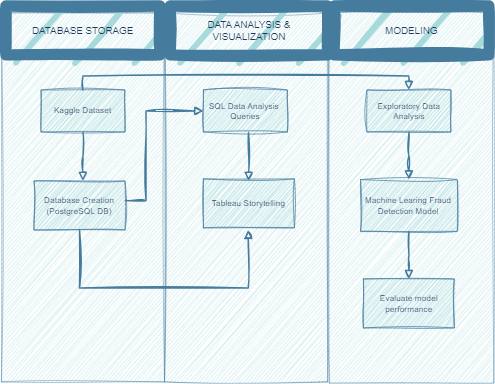

#  Credit Card Fraud

## Introduction 
**Author**: Dang Yen Linh

**Email**: dangyenlinhh@gmail.com

**Linkedln**: https://www.linkedin.com/in/dangyenlinhh/

Tableau Public link: [CreditCardFraud](https://public.tableau.com/app/profile/linh.dang.yen/viz/CreditCardFraud_17056770323210/Story1)

SQL link:

Python link:

## Project Overview
  This project utilizes **SQL** for data exploration, **Tableau** for visualization, and **Python** for EDA. Additionally, machine learning models are employed for fraud detection. The project's goals include preventing fraud, understanding customer behavior, and providing actionable visualizations for effective decision-making. The outcome is a fortified security infrastructure and improved customer experience through personalized services.

## Data sources
The dataset was obtained from Kaggle, the Credit Card Transaction dataset spans from January 1st, 2019, to December 31st, 2020. It comprises transactions by 1000 customers across 800 merchants. The dataset includes a training set (1296675, 22) and a test set (555719, 22), serving as the foundation for analysis and model development.

Here's the Kaggle link: https://www.kaggle.com/datasets/kartik2112/fraud-detection 

## Approach

